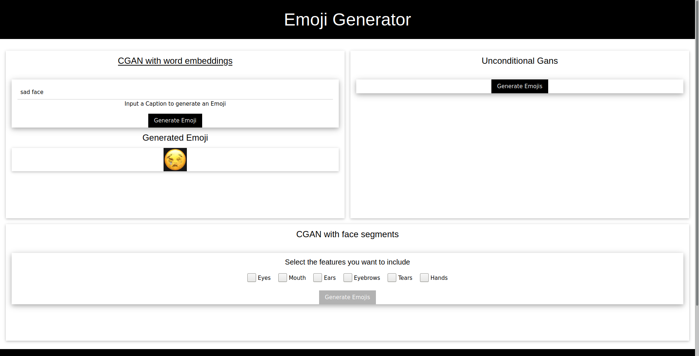

# Emoji-Generator
Create new emojis using machine learning

## Requirements
* Flask 1.1.2
* torch 1.5.1
* torchvision 0.6.1
* sklearn 0.0
* matplotlib 3.2.2
* nlkt 3.5

You can install them via pip by using the ```requirements.txt``` file. 
```
pip install -r requirements.txt
```

The CGAN with word embeddings requires to download the 300dimensional pre-trained glove embeddings file from https://nlp.stanford.edu/projects/glove/
and to put it into the ```cgan/embeddings``` folder.
## UI

Our UI is a web-based interface which runs on a flask server.
Here is how you can start it from the root folder of this project:
```
export FLASK_APP=ui/flask_emoji
python -m flask run
 ```
This will take a while since the server pre-loads the embedding model and the pca statistics when it starts the server.

Once the console shows:  
```Running on http://127.0.0.1:5000/```  
You can access the UI by opening  ```http://localhost:5000/index/``` in your browser.

## Training & Evaluating the models
There are scripts for training and evaluation of our models in the corresponding folders.

## Datasets

### Images
Our Emoji images are in the folder ``emoji_data``. It contains 64x64 images of emoji faces of facebook, google, twitter, apple and wechat.
However for our training we did not use the wechat images since they are much smaller in terms of the area the face covers in the image.

### Segments
We manually annotated our images with the [*Computer Vison Annotation Tool (cvat)*](https://cvat.org/).
With these annotations we extracted the different segments of the faces. For this purpose we consider the Emojis to consist of six segments
namely *mouth, eyes, ears, eyebrows, tears, hands* (a hat is considered as ears and hearts are considered as tears).
The different extracted segments can be found in ```segmentation/segmentation_data```.


### Descriptions
We also have descriptions for each Emoji taken from https://github.com/gucci-j/emoji-gan. They can be found in the file
```cgan/descriptions.csv``` where the unicode strings of the emojis are mapped to long and short descriptions.
